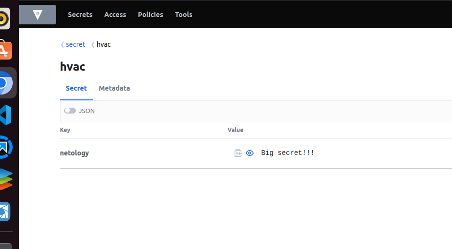
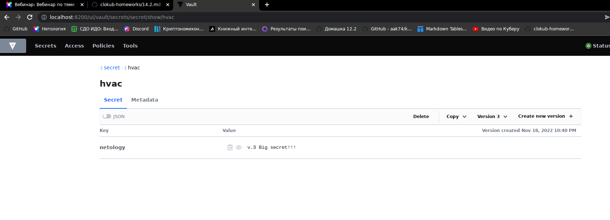
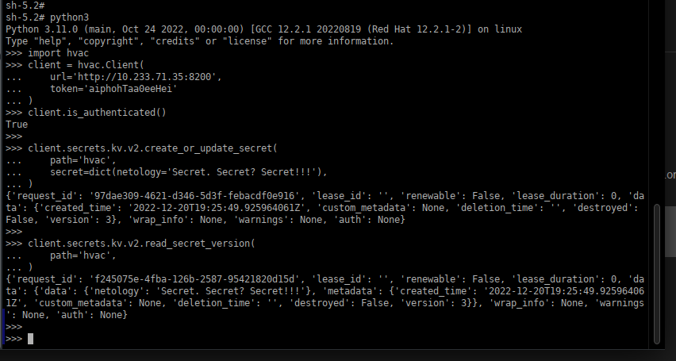
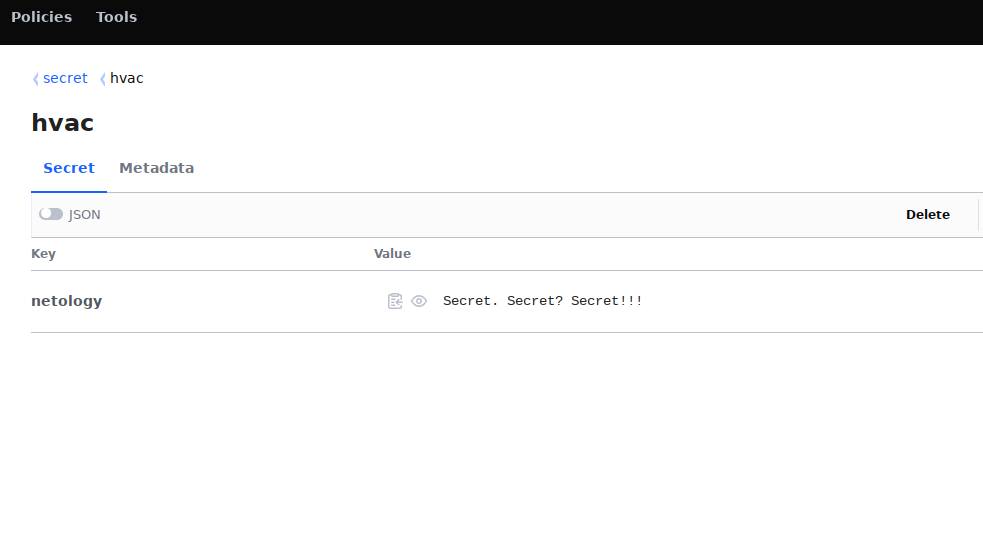

# Домашнее задание к занятию "14.2 Синхронизация секретов с внешними сервисами. Vault"

## Задача 1: Работа с модулем Vault

Запустить модуль Vault конфигураций через утилиту kubectl в установленном minikube

Получить значение внутреннего IP пода

Запустить второй модуль для использования в качестве клиента

Установить дополнительные пакеты

Запустить интепретатор Python и выполнить следующий код, предварительно
поменяв IP и токен

---

## Ответ:

Такие были команды и их вывод:

```
user@intel:~/Документы/Netology/14.2$ kubectl apply -f vault-pod.yml
pod/14.2-netology-vault created
user@intel:~/Документы/Netology/14.2$ kubectl get pod 14.2-netology-vault -o json | jq -c '.status.podIPs'
[{"ip":"10.233.71.32"}]
user@intel:~/Документы/Netology/14.2$ 
kubectl run -i --tty fedora --image=fedora --restart=Never -- sh
If you don't see a command prompt, try pressing enter.
sh-5.1# dnf -y install pip
Fedora 37 - x86_64                                                                                                            3.7 MB/s |  64 MB     00:17    
Fedora 37 openh264 (From Cisco) - x86_64                                                                                      1.3 kB/s | 2.5 kB     00:01    
Fedora Modular 37 - x86_64                                                                                                    1.8 MB/s | 3.0 MB     00:01    
Fedora 37 - x86_64 - Updates                                                                                                  3.1 MB/s |  16 MB     00:05    
Fedora Modular 37 - x86_64 - Updates                                                                                          758 kB/s | 912 kB     00:01    
Last metadata expiration check: 0:00:01 ago on Mon Dec  5 17:04:03 2022.
Dependencies resolved.
==============================================================================================================================================================
 Package                                     Architecture                    Version                                   Repository                        Size
==============================================================================================================================================================
Installing:
 python3-pip                                 noarch                          22.2.2-3.fc37                             updates                          3.1 M
Installing weak dependencies:
 libxcrypt-compat                            x86_64                          4.4.28-3.fc37                             fedora                            89 k
 python3-setuptools                          noarch                          62.6.0-2.fc37                             fedora                           1.6 M

Transaction Summary
==============================================================================================================================================================
Install  3 Packages

Total download size: 4.8 M
Installed size: 23 M
Downloading Packages:
(1/3): libxcrypt-compat-4.4.28-3.fc37.x86_64.rpm                                                                              490 kB/s |  89 kB     00:00    
(2/3): python3-setuptools-62.6.0-2.fc37.noarch.rpm                                                                            1.1 MB/s | 1.6 MB     00:01    
(3/3): python3-pip-22.2.2-3.fc37.noarch.rpm                                                                                   1.7 MB/s | 3.1 MB     00:01    
--------------------------------------------------------------------------------------------------------------------------------------------------------------
Total                                                                                                                         1.5 MB/s | 4.8 MB     00:03     
Running transaction check
Transaction check succeeded.
Running transaction test
Transaction test succeeded.
Running transaction
  Preparing        :                                                                                                                                      1/1 
  Installing       : python3-setuptools-62.6.0-2.fc37.noarch                                                                                              1/3 
  Installing       : libxcrypt-compat-4.4.28-3.fc37.x86_64                                                                                                2/3 
  Installing       : python3-pip-22.2.2-3.fc37.noarch                                                                                                     3/3 
  Running scriptlet: python3-pip-22.2.2-3.fc37.noarch                                                                                                     3/3 
  Verifying        : libxcrypt-compat-4.4.28-3.fc37.x86_64                                                                                                1/3 
  Verifying        : python3-setuptools-62.6.0-2.fc37.noarch                                                                                              2/3 
  Verifying        : python3-pip-22.2.2-3.fc37.noarch                                                                                                     3/3 

Installed:
  libxcrypt-compat-4.4.28-3.fc37.x86_64                python3-pip-22.2.2-3.fc37.noarch                python3-setuptools-62.6.0-2.fc37.noarch               

Complete!
sh-5.1# pip install hvac
Collecting hvac
  Downloading hvac-1.0.2-py3-none-any.whl (143 kB)
     ━━━━━━━━━━━━━━━━━━━━━━━━━━━━━━━━━━━━━━━━ 143.5/143.5 kB 857.1 kB/s eta 0:00:00
Collecting pyhcl<0.5.0,>=0.4.4
  Downloading pyhcl-0.4.4.tar.gz (61 kB)
     ━━━━━━━━━━━━━━━━━━━━━━━━━━━━━━━━━━━━━━━━ 61.1/61.1 kB 1.9 MB/s eta 0:00:00
  Installing build dependencies ... done
  Getting requirements to build wheel ... done
  Preparing metadata (pyproject.toml) ... done
Collecting requests<3.0.0,>=2.27.1
  Downloading requests-2.28.1-py3-none-any.whl (62 kB)
     ━━━━━━━━━━━━━━━━━━━━━━━━━━━━━━━━━━━━━━━━ 62.8/62.8 kB 2.2 MB/s eta 0:00:00
Collecting charset-normalizer<3,>=2
  Downloading charset_normalizer-2.1.1-py3-none-any.whl (39 kB)
Collecting idna<4,>=2.5
  Downloading idna-3.4-py3-none-any.whl (61 kB)
     ━━━━━━━━━━━━━━━━━━━━━━━━━━━━━━━━━━━━━━━━ 61.5/61.5 kB 1.8 MB/s eta 0:00:00
Collecting urllib3<1.27,>=1.21.1
  Downloading urllib3-1.26.13-py2.py3-none-any.whl (140 kB)
     ━━━━━━━━━━━━━━━━━━━━━━━━━━━━━━━━━━━━━━━━ 140.6/140.6 kB 1.9 MB/s eta 0:00:00
Collecting certifi>=2017.4.17
  Downloading certifi-2022.9.24-py3-none-any.whl (161 kB)
     ━━━━━━━━━━━━━━━━━━━━━━━━━━━━━━━━━━━━━━━━ 161.1/161.1 kB 1.5 MB/s eta 0:00:00
Building wheels for collected packages: pyhcl
  Building wheel for pyhcl (pyproject.toml) ... done
  Created wheel for pyhcl: filename=pyhcl-0.4.4-py3-none-any.whl size=50127 sha256=2ceefa9e403ffc78edf97b9cb1598374d0de7634a8522698c385a61c07ba0b56
  Stored in directory: /root/.cache/pip/wheels/e4/f4/3a/691e55b36281820a2e2676ffd693a7f7a068fab60d89353d74
Successfully built pyhcl
Installing collected packages: pyhcl, urllib3, idna, charset-normalizer, certifi, requests, hvac
Successfully installed certifi-2022.9.24 charset-normalizer-2.1.1 hvac-1.0.2 idna-3.4 pyhcl-0.4.4 requests-2.28.1 urllib3-1.26.13
WARNING: Running pip as the 'root' user can result in broken permissions and conflicting behaviour with the system package manager. It is recommended to use a virtual environment instead: https://pip.pypa.io/warnings/venv
```
Такие получились поды:


Так секреты посоздавал:



Так отработал python-код:
 

Такой результат в Vault:
 